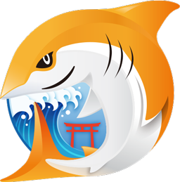
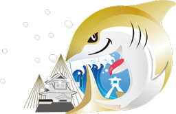
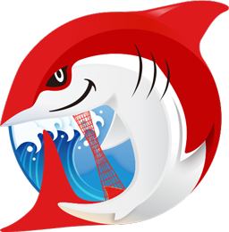
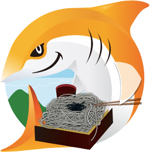
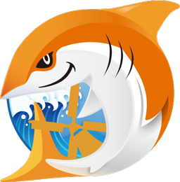
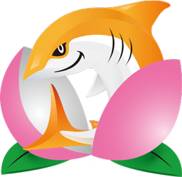
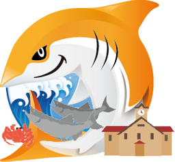

# Logo

JAWS-UG各支部のロゴです。

# Licence

 JAWS-UG logo is licensed under a <a rel="license" href="http://creativecommons.org/licenses/by-nc/4.0/">Creative Commons Attribution-NonCommercial 4.0 International License</a>.

 <a xmlns:cc="http://creativecommons.org/ns#" href="http://jaws-ug.jp/" property="cc:attributionName" rel="cc:attributionURL">JAWS-UG</a> 各支部の『JAWS-UGロゴ』は<a rel="license" href="http://creativecommons.org/licenses/by-nc/4.0/">クリエイティブ・コモンズ 表示 - 非営利 4.0 国際 ライセンス</a>で提供されています。

# 一覧
ロゴマークのみ一覧。（256px幅・背景透過pngで一律書き出し） 
ロゴタイプ等はそれぞれのファイルを参照してください。
<table style="text-align:center; line-height:1.3; font-size:0.9; color:#999;">
<tr>
	<td colspan="3">
	
	 
	ベース / base
	</td>
</tr>
<tr>
	<td>
E-JAWS
</td>
	<td>
HPC
</td>
	<td>
JAWSUG青森 / aomori
</td>
</tr>
<tr>
	<td>
初心者支部 / beginner
</td>
	
	<td>
福井支部 / fukui
</td>
	
	<td>
東海道と浜松支部  / hamamatsu
</td>
	
</tr>
<tr>
	<td>
広島支部 / hiroshima
</td>
	<td>
上越妙高支部 / joetsumyoko
</td>
	<td>
金沢支部 / kanazawa
</td>
</tr>
<tr>
	<td>
kansai-girls
</td>
	<td>
神戸支部 / kobe
</td>
	<td>
長野支部 / nagano
</td>
</tr>

<tr>
	<td>
netherlands
</td>
	<td>
大分支部 / oita
</td>
	<td>
岡山支部 / okayama
</td>
</tr>
<tr>
	<td>
沖縄支部 / okinawa
</td>
	<td>
大阪支部 / osaka
</td>
	<td>
札幌支部 / sapporo
</td>
</tr>

<tr>
	<td>
島根支部 / shimane
</td>
	<td>
湘南支部 / shonan
</td>
	<td>
東北支部 / tohoku
</td>
</tr>

<tr>
	<td>
東海道 / tokaido
</td>
	<td>
山形支部 / yamagata
</td>
	<td>
横浜支部 / yokohama
</td>
</tr>

</table>