# Logo

JAWS-UG各支部のロゴです。

# Licence

 JAWS-UG logo is licensed under a <a rel="license" href="http://creativecommons.org/licenses/by-nc/4.0/">Creative Commons Attribution-NonCommercial 4.0 International License</a>.

 <a xmlns:cc="http://creativecommons.org/ns#" href="http://jaws-ug.jp/" property="cc:attributionName" rel="cc:attributionURL">JAWS-UG</a> 各支部の『JAWS-UGロゴ』は<a rel="license" href="http://creativecommons.org/licenses/by-nc/4.0/">クリエイティブ・コモンズ 表示 - 非営利 4.0 国際 ライセンス</a>で提供されています。

# 一覧
ロゴマークのみ一覧。（256px幅・背景透過pngで一律書き出し）  
[勉強会グループ一覧](https://jaws-ug.jp/act/) に記載されている支部に限る。  
ロゴタイプ等はそれぞれのファイルを参照してください。

### ベースロゴ
<table style="text-align:center; line-height:1.3; font-size:0.9; color:#444;">
<tr>
	<td colspan="3">
	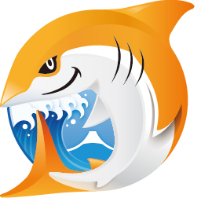
ベース / base
</td>
</tr>
</table>

### エリア別

<table style="text-align:center; line-height:1.3; font-size:0.9; color:#444;">
<tr>
	<td>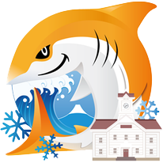
札幌支部 / sapporo
</td>
	<td>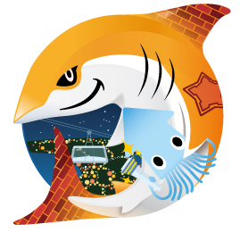
函館支部 / hakodate
</td>
	<td>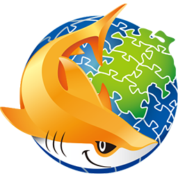
東北支部 / tohoku
</td>
	<td>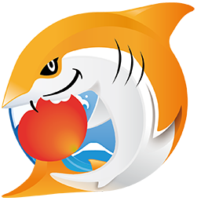
青森支部 / aomori
</td>
</tr>
<tr>
	<td>
秋田支部 / akita
</td>
	<td>
いわて支部 / iwate
</td>
	<td>
仙台支部 / sendai
</td>
	<td>
山形支部 / yamagata
</td>
</tr>
<tr>
	<td>
会津支部 / aizu
</td>
	<td>
千葉支部 / chiba
</td>
	<td>
彩の国埼玉支部 / sainokuni
</td>
	<td>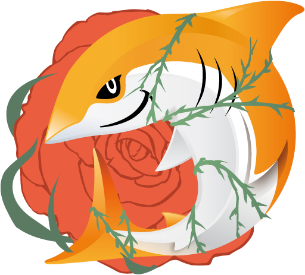
茨城支部 / ibaraki
</td>
</tr>
<tr>
	<td>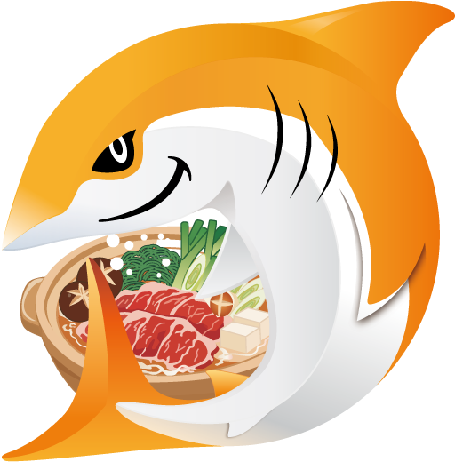
群馬支部 / gunma
</td>
	<td>
栃木支部 / tochigi
</td>
	<td>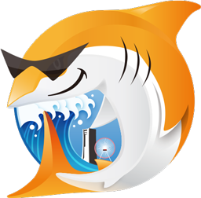
横浜支部 / yokohama
</td>
	<td>
新潟支部 / niigata
</td>
</tr>
<tr>
	<td>
富山支部 / toyama
</td>
	<td>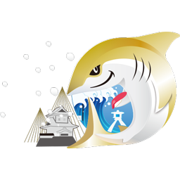
金沢支部 / kanazawa
</td>
	<td>
福井支部 / fukui
</td>
	<td>
山梨支部 / yamanashi
</td>
</tr>
<tr>
	<td>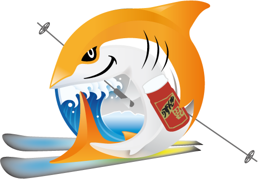
上越妙高支部 / joetsumyoko
</td>
	<td>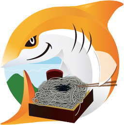
長野支部 / nagano
</td>
	<td>
静岡支部 / shizuoka
</td>
	<td>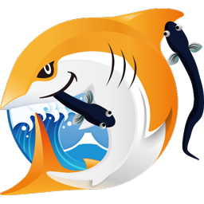
浜松支部 / hamamatsu
</td>
</tr>
<tr>
	<td>
JAWS-UG 名古屋 / nagoya
</td>
	<td>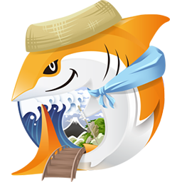
JAWS-UG 東海道 / tokaido
</td>
	<td>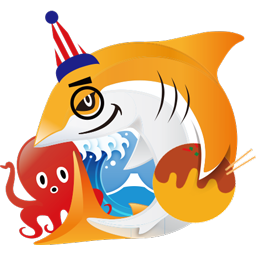
大阪支部 / osaka
</td>
	<td>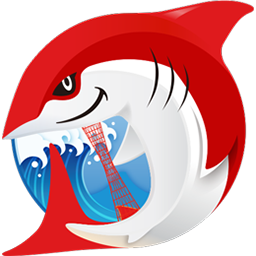
神戸支部 / kobe
</td>
</tr>
<tr>
	<td>
京都支部 / kyoto
</td>
	<td>
島根支部 / shimane
</td>
	<td>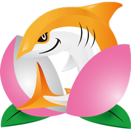
岡山支部 / okayama
</td>
	<td>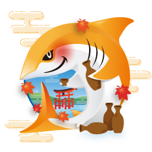
広島支部 / hiroshima
</td>
</tr>
<tr>
	<td>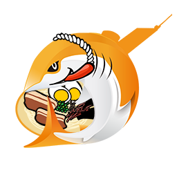
福岡支部 / fukuoka
</td>
	<td>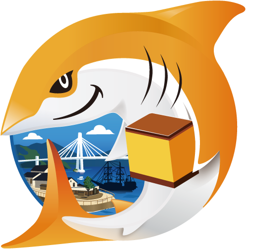
長崎支部 / nagasaki
</td>
	<td>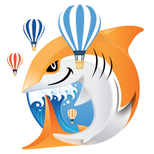
佐賀支部 / saga
</td>
	<td>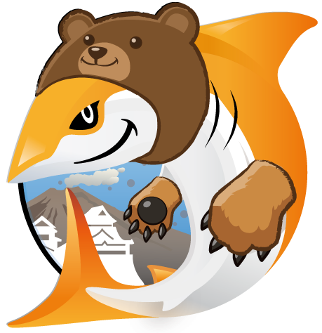
熊本支部 / kumamoto
</td>
</tr>
<tr>
	<td>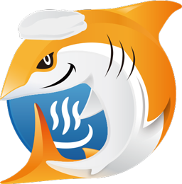
大分支部 / oita
</td>
	<td>
鹿児島支部 / kagoshima
</td>
	<td>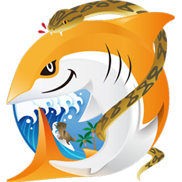
沖縄支部 / okinawa
</td>
	<td>&nbsp;</td>
</tr>
</table>

## 目的別
<table style="text-align:center; line-height:1.3; font-size:0.9; color:#444;">
<tr>
	<td>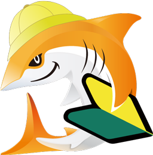
初心者支部
</td>
	<td>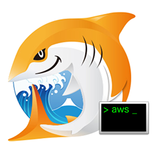
CLI 専門支部
</td>
	<td>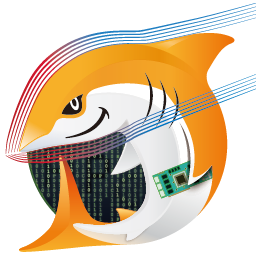
HPC
</td>
	<td>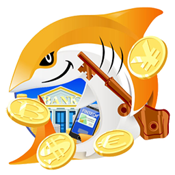
Fin-JAWS
</td>
</tr>
<tr>
	<td>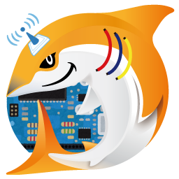
IoT 専門支部
</td>
	<td>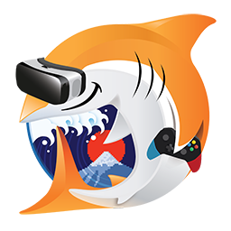
GameTech 専門支部
</td>
	<td>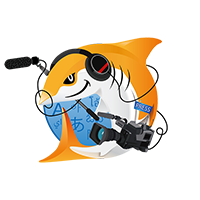
Media-JAWS
</td>
	<td>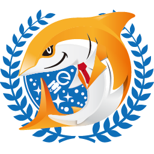
E-JAWS
</td>
</tr>
<tr>
	<td>
Gov-JAWS
</td>
	<td>
Education-JAWS
</td>
	<td>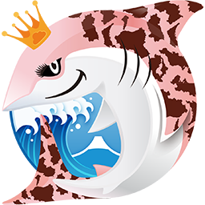
DE&I
</td>
	<td>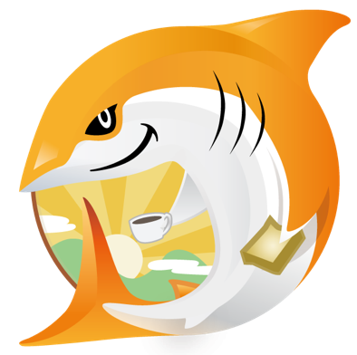
朝会
</td>
</tr>
<tr>
	<td>
クラウド女子会
</td>
	<td>
NW-JAWS
</td>
	<td>
Security-JAWS
</td>
	<td>
Sales
</td>
</tr>
<tr>
	<td>
CDK支部
</td>
	<td>
OPS-JAWS
</td>
	<td>
コンテナ支部
</td>
	<td>
Storage-JAWS
</td>
</tr>
<tr>
	<td>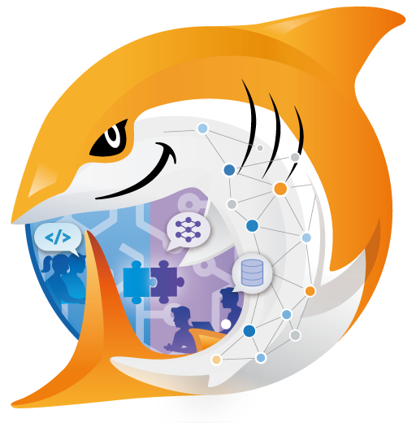
AI-DLC
</td>
	<td>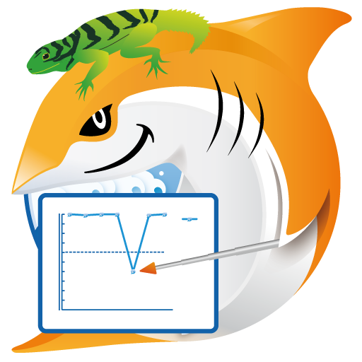
SRE支部
</td>
	<td>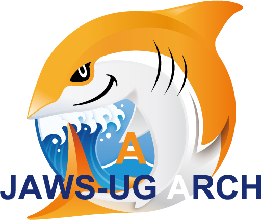
アーキテクチャ専門支部
</td>
	<td>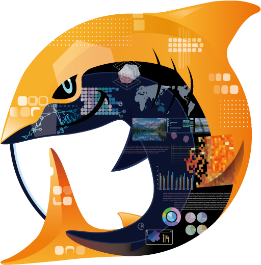
ビッグデータ支部
</td>
</tr>
<tr>
	<td>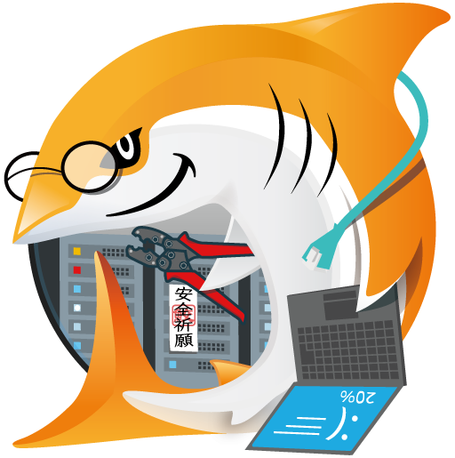
情シス支部
</td>
	<td>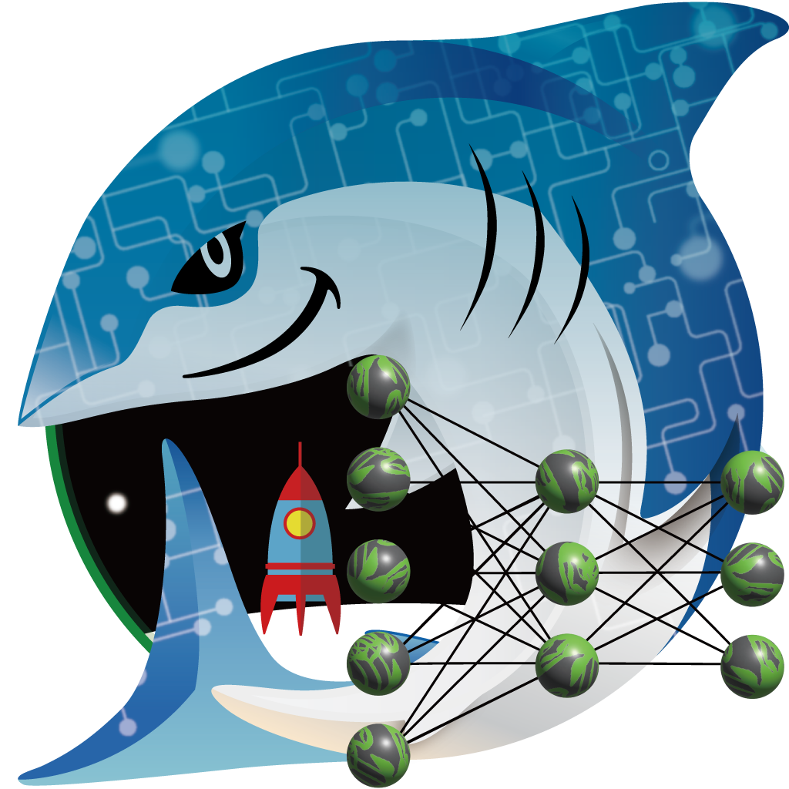
AI/ML支部
</td>
	<td></td>
	<td></td>
</tr>
</table>

## イベント・その他
<table style="text-align:center; line-height:1.3; font-size:0.9; color:#444;">
<tr>
	<td>
Security-JAWS & IAM Special
</td>
	<td>
Security-JAWS DAYS
</td>
	<td>&nbsp;</td>
	<td>&nbsp;</td>
</tr>
<tr>
	<td>
JAWS-UG 配信部
</td>
	<td>
JAWS SONIC & Midnight JAWS 2020
</td>
	<td>
JAWS SONIC & Midnight JAWS 2026
</td>
	<td>&nbsp;</td>
</tr>
<tr>
	<td>
JAWS DAYS 2019 - 満漢全席
</td>
	<td>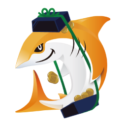
JAWS DAYS 2020 - さめのおんがえし
</td>
	<td>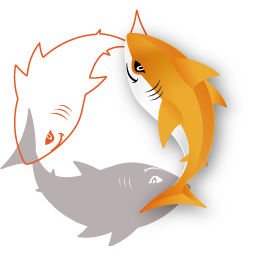
JAWS DAYS 2021 - re:Connect
</td>
	<td>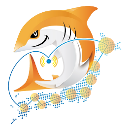
JAWS DAYS 2022 - Satellites
</td>
</tr>
<tr>
	<td>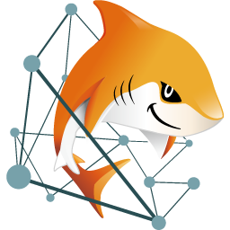
JAWS DAYS 2024 - Leap Beyond
</td>
	<td>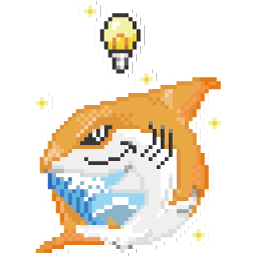
JAWS DAYS 2025 - Connecting the dots
</td>
	<td>&nbsp;</td>
	<td>&nbsp;</td>
</tr>
<tr>
	<td>
JAWS FESTA 2025 in 金沢
</td>
	<td>
JAWS FESTA 2026 AKITA
</td>
	<td>&nbsp;</td>
	<td>&nbsp;</td>
</tr>
<tr>
	<td>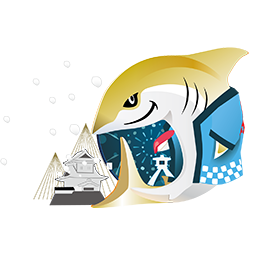
Summer FIREWORKShop
</td>
	<td>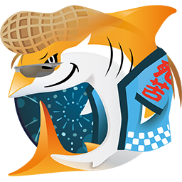
Summer FIREWORKShop
</td>
	<td>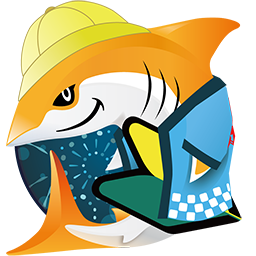
Summer FIREWORKShop
</td>
	<td>&nbsp;</td>
</tr>
</table>
