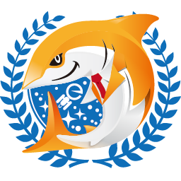

# Logo

JAWS-UG各支部のロゴです。

# Licence

 JAWS-UG logo is licensed under a <a rel="license" href="http://creativecommons.org/licenses/by-nc/4.0/">Creative Commons Attribution-NonCommercial 4.0 International License</a>.

 <a xmlns:cc="http://creativecommons.org/ns#" href="http://jaws-ug.jp/" property="cc:attributionName" rel="cc:attributionURL">JAWS-UG</a> 各支部の『JAWS-UGロゴ』は<a rel="license" href="http://creativecommons.org/licenses/by-nc/4.0/">クリエイティブ・コモンズ 表示 - 非営利 4.0 国際 ライセンス</a>で提供されています。

# 一覧
ロゴマークのみ一覧。（256px幅・背景透過pngで一律書き出し）  
[勉強会グループ一覧](https://jaws-ug.jp/act/) に記載されている支部に限る。  
ロゴタイプ等はそれぞれのファイルを参照してください。

### ベースロゴ
<table style="text-align:center; line-height:1.3; font-size:0.9; color:#444;">
<tr>
	<td colspan="3">
	
ベース / base
</td>
</tr>
</table>

### エリア別

<table style="text-align:center; line-height:1.3; font-size:0.9; color:#444;">
<tr>
	<td>
札幌支部 / sapporo
</td>
	<td>
東北支部 / tohoku
</td>
	<td>
青森支部 / aomori
</td>
<td>
横浜支部 / yokohama
</td>
</tr>
<tr>
	<td>
千葉支部 / chiba
</td>
	<td>
茨城支部 / ibaraki
</td>
	<td>
群馬支部 / gunma
</td>
	<td>
金沢支部 / kanazawa
</td>
</tr>
<tr>
	<td>
浜松支部 / hamamatsu
</td>
	<td>
長野支部 / nagano
</td>
	<td>
名古屋支部 / nagoya
</td>
	<td>
大阪支部 / osaka
</td>
</tr>
<tr>
	<td>
神戸支部 / kobe
</td>
	<td>
岡山支部 / okayama
</td>
	<td>
大阪支部 / osaka
</td>
	<td>
広島支部 / hiroshima
</td>
</tr>
<tr>
	<td>
福岡支部 / fukuoka
</td>
	<td>
大分支部 / oita
</td>
	<td>
沖縄支部 / okinawa
</td>
	<td></td>
</tr>
</table>

## 目的別
<table style="text-align:center; line-height:1.3; font-size:0.9; color:#444;">
<tr>
	<td> 初心者支部</td>
	<td> CLI 専門支部</td>
	<td> HPC</td>
	<td> Fin-JAWS</td>
</tr>
<tr>
	<td> IoT 専門支部</td>
	<td> 朝会</td>
	<td> GameTech 専門支部</td>
	<td></td>
</tr>
<tr>
	<td> E-JAWS</td>
	<td> Media-JAWS</td>
	<td> 関西女子</td>
	<td></td>
</tr>
</table>

## イベント
<table style="text-align:center; line-height:1.3; font-size:0.9; color:#444;">
<tr>
	<td> JAWS SONIC & Midnight JAWS 2020</td>
	<td> JAWS DAYS 2019 - 満漢全席</td>
	<td> JAWS DAYS 2020 - さめのおんがえし</td>
	<td> JAWS DAYS 2021 - re:Connect</td>
</tr>
<tr>
	<td> JAWS DAYS 2021 - Satellites</td>
	<td> JAWS DAYS 2024 - Leap Beyond</td>
	<td> JAWS DAYS 2025 - Connecting the dots</td>
	<td> Summer FIREWORKShop</td>
</tr>
<tr>
	<td> Summer FIREWORKShop
</td>
	<td> Summer FIREWORKShop</td>
	<td></td>
	<td></td>
</tr>
</table>

