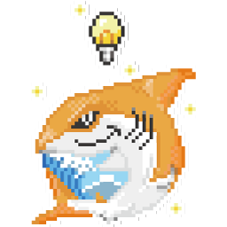

# Logo

JAWS-UG各支部のロゴです。

# Licence

 JAWS-UG logo is licensed under a <a rel="license" href="http://creativecommons.org/licenses/by-nc/4.0/">Creative Commons Attribution-NonCommercial 4.0 International License</a>.

 <a xmlns:cc="http://creativecommons.org/ns#" href="http://jaws-ug.jp/" property="cc:attributionName" rel="cc:attributionURL">JAWS-UG</a> 各支部の『JAWS-UGロゴ』は<a rel="license" href="http://creativecommons.org/licenses/by-nc/4.0/">クリエイティブ・コモンズ 表示 - 非営利 4.0 国際 ライセンス</a>で提供vされています。

# 一覧
ロゴマークのみ一覧。（256px幅・背景透過pngで一律書き出し）  
[勉強会グループ一覧](https://jaws-ug.jp/act/) に記載されている支部に限る。  
ロゴタイプ等はそれぞれのファイルを参照してください。

## ベースロゴ

	
 ベース / base

## エリア別

	

		
 札幌支部 / sapporo

		
 函館支部 / hakodate

		
 東北支部 / tohoku

		
 青森支部 / aomori

	

	

		
 横浜支部 / yokohama

		
 千葉支部 / chiba

		
 茨城支部 / ibaraki

		
 群馬支部 / gunma

	

	

		
 金沢支部 / kanazawa

		
 浜松支部 / hamamatsu

		
 長野支部 / nagano

		
 名古屋支部 / nagoya

	

	

		
 大阪支部 / osaka

		
 神戸支部 / kobe

		
 岡山支部 / okayama

		
 大阪支部 / osaka

	
	
	

		
 広島支部 / hiroshima

		
 福岡支部 / fukuoka

		
 大分支部 / oita

		
 佐賀支部 / saga

	

	

		
 沖縄支部 / okinawa

	

## 目的別

	

		
 初心者支部

		
 CLI 専門支部

		
 HPC

		
 Fin-JAWS

	

	

		
 IoT 専門支部

		
 朝会

		
 GameTech 専門支部

		
 E-JAWS

	

	

		
 Media-JAWS

		
 関西女子

	

## イベント

	

		
 JAWS SONIC & Midnight JAWS 2020

		
 JAWS DAYS 2019 - 満漢全席

		
 JAWS DAYS 2020 - さめのおんがえし

		
 JAWS DAYS 2020 - さめのおんがえし

	

	

		
 JAWS DAYS 2021 - Satellites
		

		
 JAWS DAYS 2024 - Leap Beyond

		
 JAWS DAYS 2025 - Connecting the dots

		
 Summer FIREWORKShop

	

	

		
 Summer FIREWORKShop
		

		
 Summer FIREWORKShop

	

